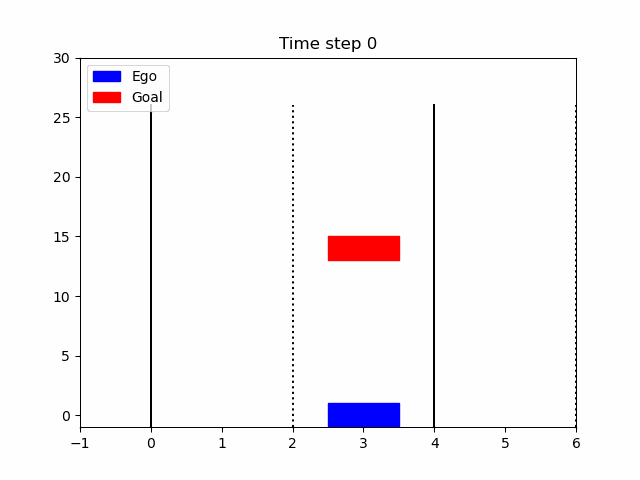

    **1. 数组和字符串操作**：深度学习中经常需要对数据进行操作，理解数组和字符串的算法可以帮助你更有效地处理数据预处理和特征工程。

    **2. 链表和树**：深度学习模型中有些结构（如神经网络的层）可以类比为树形结构，理解树的遍历和操作对于设计复杂的模型架构有帮助。

    **3. 图算法**：深度学习中的某些算法，如卷积神经网络（CNN）和图神经网络（GNN），与图论有密切关系。学习图算法可以加深对这些模型的理解。

    **4. 动态规划**：虽然不直接用于深度学习模型，但动态规划的思想可以帮助你优化模型训练过程中的某些步骤，比如序列模型的训练。

    **5. 排序和搜索算法**：排序和搜索算法是算法基础中的重要部分，它们在数据处理和特征选择中非常有用。

    **6. 递归和分治**：递归和分治策略在解决复杂问题时非常有用，这可以帮助你更好地设计和理解深度学习算法。

    **7. 贪心算法**：贪心算法在某些优化问题中很有用，比如在模型的超参数选择中。

    **8. 堆和优先队列**：在处理某些类型的数据流或时间序列预测时，堆和优先队列非常有用。

    **9. 哈希表和散列**：哈希表在实现快速查找和数据结构中非常有用，这对于实现高效的数据处理管道很有帮助。

    **10. 并查集**：并查集在处理一些图论问题时非常有用，虽然在深度学习中不常用，但有助于锻炼解决复杂问题的能力。

    **11. 数学问题**：深度学习中很多算法都涉及到数学，解决数学问题可以加深对深度学习中涉及的数学概念的理解。

    **12. 机器学习相关问题**：LeetCode 也有一些与机器学习相关的题目，这些题目直接与深度学习相关，可以帮助你更好地理解模型的工作原理。

continue ...
